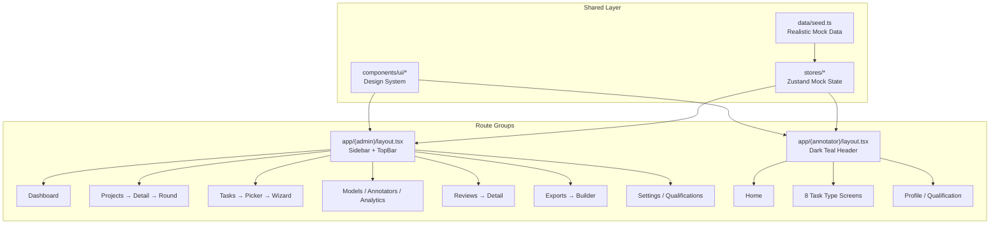

# feat: Build RLHF DataForge MVP — 34-Screen Interactive Prototype

## Overview

Build a pixel-perfect, Vercel-hosted interactive prototype of RLHF DataForge — a SaaS platform for collecting and managing human feedback data for LLM alignment. The deliverable is 34 screens across two apps (Admin + Annotator) in a single Next.js project, with Framer Motion animations, Zustand mock state, and Recharts visualizations. The prototype must be indistinguishable from a production product.

## Problem Frame

The user needs a high-fidelity clickthrough prototype that can be shared with a team and mistaken for a real product. This is not a wireframe or rough prototype — it must match the Paper designs at pixel-level precision, including exact spacing, typography, colors, border radii, and interaction polish (hover states, focus rings, micro-animations, route transitions).

## Requirements Trace

- R1. 34 screens across Admin (22 screens) and Annotator (12 screens) interfaces
- R2. Pixel-perfect match to Paper MCP designs using the Spectrum Design System v1.1.0
- R3. Next.js 14 App Router with route groups `(admin)` and `(annotator)`
- R4. Zustand mock state — mutations appear in lists (tasks added show up, etc.)
- R5. Framer Motion micro-animations (count-up, stagger-fade, route transitions, etc.)
- R6. Recharts for dashboard charts and analytics
- R7. Full interaction polish (hover, focus-visible, active, disabled, loading states)
- R8. Deployed to Vercel with live URL returned

## Scope Boundaries

- No backend, database, or API — all data is mock/static via Zustand stores
- No authentication — pages are directly accessible
- No real model API integration — streaming indicators are simulated
- No responsive/mobile layouts — designs are 1440x1024px fixed
- No dark mode (annotator header is dark teal, but pages are light theme)

### Deferred to Separate Tasks

- Real API integration: future iteration
- Mobile responsiveness: future iteration
- E2E testing: separate PR after MVP ships

## Context & Research

### Design System (from Paper MCP — Tokens artboard)

**Colors:**
| Token | Value | Usage |
|---|---|---|
| Ink | `#1A1E1D` | Primary text, headings |
| Deep Teal | `#005151` | Primary buttons, annotator header, active sidebar |
| Off White | `#FFFEFE` | Page backgrounds |
| Level 1 Surface | `#F7F8F8` | Card backgrounds, input fills |
| Level 2 Border Light | `#EBEEED` | Card borders, dividers |
| Level 3 Border | `#D9DCB8` | Heavier borders |
| Secondary Text | `#556260` | Sidebar section headers, muted labels |
| Tertiary Text | `#6F7A77` | Placeholders, helpers |
| Primary Action | `#005151` | Links, active states |
| Success | `#059669` | Positive trends, passing metrics |
| Caution | `#D97706` | Warnings, review states |
| Error | `#DC2626` | Errors, failing metrics |
| Info | `#2563EB` | Informational alerts |

**Typography (from designs, overriding instructions.md):**
| Font | Family | Usage |
|---|---|---|
| Literata | Serif | Page headings (ALL CAPS), dashboard stat numbers |
| Inter | Sans-serif | Body text, labels, form fields, table content |
| IBM Plex Mono | Monospace | Code blocks, data values, version strings |

**Type Scale:**
- Display Hero: 57px / 600 / -0.25px
- Display Large: 45px / 600 / 0px
- Headline Large: 32px / 400 / 0px
- Headline Medium: 28px / 600 / 0px
- Headline Small: 24px / 400 / 0px
- Title Large: 22px / 500 / 0px (Inter)
- Body Large: 16px / 400 / +0.5px (Inter)
- Body Medium: 14px / 400 / +0.25px (Inter)
- Label Large: 14px / 400 / +0.25px (Inter)
- Label Medium: 13px / 500 / +0.5px (Inter)
- Label Small: 11px / 500 / +0.5px (Inter, ALL CAPS)
- Code Small: 12px / 400 / 0px (IBM Plex Mono)
- Code Large: 16px / 400 / 0px (IBM Plex Mono)

**Border Radius:**
- Tight: 4px (badges, chips)
- Standard: 6px (buttons, inputs)
- Comfortable: 8px (cards, panels)
- Featured: 12px (hero cards, modals)
- Pill: 9999px (marketing CTAs only)

**Spacing Scale:** 4 / 8 / 12 / 16 / 20 / 24 / 32 / 48 / 80px

### Interface Patterns

**Admin Layout:** 200px left sidebar + main content at 1440x1024px. Sidebar has grouped nav under labeled sections (ADMIN, WORKFORCE, QUALITY, DATA). Active item: light teal bg `#E6F2F2` + teal text `#005151`. Top bar: "DF DATAFORGE" logo left, org selector + avatar right.

**Annotator Layout:** Full-width, no sidebar. Dark teal `#005151` header bar with DF branding, "ANNOTATOR" badge, "My Profile" button, avatar + name. Task screens add progress counter, timer, Guidelines/Flag/Skip buttons to the header.

**Card Pattern:** White bg, 1px `#EBEEED` border, 8px radius, no shadows. KPI cards at top of every admin screen with uppercase tracked labels + large serif numbers.

**Table Pattern:** Hairline borders, 14px vertical padding, no zebra striping, small uppercase tracked column headers.

## Key Technical Decisions

- **Fonts**: Use Literata, Inter, IBM Plex Mono via `next/font/google` — the designs use these, not Instrument Serif/Geist as instructions.md stated. The designs are the source of truth.
- **Route structure**: `app/(admin)/` and `app/(annotator)/` route groups with separate `layout.tsx` files
- **Mock data**: Centralized Zustand stores (`useProjectStore`, `useTaskStore`, `useAnnotatorStore`, etc.) with realistic seed data matching the designs
- **Component library**: Build a small internal design system (`Badge`, `StatCard`, `DataTable`, `Sidebar`, `Header`, etc.) before screens
- **Wizard**: 7-step task config wizard as a single route `/tasks/new/configure` with step state managed locally (URL query param or Zustand)
- **Charts**: Recharts with custom theme matching design tokens
- **Animations**: Framer Motion `AnimatePresence` for route transitions, `motion.div` for individual elements
- **No external UI library**: Pure Tailwind + custom components to maintain pixel-perfect control

## Open Questions

### Resolved During Planning

- **Font discrepancy**: instructions.md says Instrument Serif/Geist/Geist Mono; Paper designs show Literata/Inter/IBM Plex Mono → Follow designs (source of truth)
- **Screen 33 (Qualification Test Builder)**: Listed under annotator in instructions.md route list but uses admin sidebar layout → Place in `(admin)` route group at `/qualifications/builder`

### Deferred to Implementation

- Exact Recharts config for matching design chart aesthetics — will be tuned visually
- Drag-and-drop library choice for N-Way Ranking (Screen 28) — likely `@dnd-kit/core` or simple pointer events
- Exact streaming simulation timing for Multi-Turn Conversational (Screen 24)

## Output Structure

```
app/
├── (admin)/
│   ├── layout.tsx                          # Sidebar + top bar layout
│   ├── page.tsx                            # Dashboard (Screen 01)
│   ├── projects/
│   │   ├── page.tsx                        # Project List (02)
│   │   └── [id]/
│   │       └── page.tsx                    # Project Detail (03)
│   ├── campaigns/
│   │   └── [id]/
│   │       └── rounds/
│   │           └── [roundId]/
│   │               └── page.tsx            # Campaign Round Detail (04)
│   ├── tasks/
│   │   ├── page.tsx                        # Task List (05)
│   │   └── new/
│   │       ├── page.tsx                    # Template Picker (06)
│   │       └── configure/
│   │           └── page.tsx                # 7-step Wizard (07-13)
│   ├── models/
│   │   └── page.tsx                        # Model Endpoint Registry (14)
│   ├── annotators/
│   │   └── page.tsx                        # Workforce Management (15)
│   ├── analytics/
│   │   └── page.tsx                        # Quality Dashboard (16)
│   ├── reviews/
│   │   ├── page.tsx                        # Review Queue (17)
│   │   └── [id]/
│   │       └── page.tsx                    # Annotation Review Detail (18)
│   ├── exports/
│   │   ├── page.tsx                        # Export History (20)
│   │   └── new/
│   │       └── page.tsx                    # Data Export Builder (19)
│   ├── settings/
│   │   └── api-keys/
│   │       └── page.tsx                    # Settings & API Keys (21)
│   └── qualifications/
│       ├── page.tsx                        # Qualifications list
│       └── builder/
│           └── page.tsx                    # Qualification Test Builder (33)
├── (annotator)/
│   ├── layout.tsx                          # Dark teal header layout
│   ├── annotate/
│   │   ├── page.tsx                        # Annotator Home (22)
│   │   ├── [id]/
│   │   │   └── pairwise/
│   │   │       └── page.tsx                # Pairwise Preference (23)
│   │   ├── profile/
│   │   │   └── page.tsx                    # Annotator Profile (31)
│   │   └── qualification/
│   │       └── [id]/
│   │           └── page.tsx                # Qualification Test (32)
│   ├── chat/
│   │   └── page.tsx                        # Multi-Turn Conversational (24)
│   ├── sft/
│   │   └── page.tsx                        # SFT Data Authoring (25)
│   ├── red-team/
│   │   └── page.tsx                        # Safety Red-Teaming (26)
│   ├── edit/
│   │   └── page.tsx                        # Response Editing (27)
│   ├── rank/
│   │   └── page.tsx                        # N-Way Ranking (28)
│   ├── rubric/
│   │   └── page.tsx                        # Rubric Scoring (29)
│   └── arena/
│       └── page.tsx                        # Model Arena (30)
├── globals.css
└── layout.tsx                              # Root layout with fonts
components/
├── ui/
│   ├── badge.tsx
│   ├── button.tsx
│   ├── stat-card.tsx
│   ├── data-table.tsx
│   ├── input.tsx
│   ├── select.tsx
│   ├── progress-bar.tsx
│   ├── toast.tsx
│   └── modal.tsx
├── admin/
│   ├── sidebar.tsx
│   ├── top-bar.tsx
│   └── page-header.tsx
├── annotator/
│   ├── header-bar.tsx
│   ├── task-header.tsx
│   └── response-panel.tsx
├── charts/
│   └── annotation-volume-chart.tsx
└── guidelines-drawer.tsx
lib/
├── fonts.ts
├── cn.ts                                   # clsx + tailwind-merge utility
└── animations.ts                           # Framer Motion variants
stores/
├── project-store.ts
├── task-store.ts
├── annotator-store.ts
├── campaign-store.ts
├── export-store.ts
└── review-store.ts
data/
└── seed.ts                                 # All mock data matching designs
```

## High-Level Technical Design

> *This illustrates the intended approach and is directional guidance for review, not implementation specification. The implementing agent should treat it as context, not code to reproduce.*



## Implementation Units

### Phase 1: Foundation

- [ ] **Unit 1: Project Scaffold & Configuration**

**Goal:** Initialize the Next.js 14 project with all dependencies, Tailwind config with design tokens, and font setup.

**Requirements:** R2, R3, R8

**Dependencies:** None

**Files:**
- Create: `package.json`
- Create: `tsconfig.json`
- Create: `next.config.js`
- Create: `tailwind.config.ts`
- Create: `postcss.config.js`
- Create: `app/layout.tsx`
- Create: `app/globals.css`
- Create: `lib/fonts.ts`
- Create: `lib/cn.ts`

**Approach:**
- `pnpm create next-app` with App Router, TypeScript strict, Tailwind, no src dir
- Install: `zustand`, `recharts`, `lucide-react`, `framer-motion`, `clsx`, `tailwind-merge`
- Configure Tailwind `theme.extend` with all design tokens (colors, spacing, radii, font families)
- Set up Literata, Inter, IBM Plex Mono via `next/font/google` with CSS variables
- `globals.css`: reset, font variable application, brand teal focus rings, scrollbar styling

**Patterns to follow:**
- Paper MCP "Tokens — Light" artboard for exact values

**Test expectation:** none — scaffolding only, verified by `pnpm dev` running without errors

**Verification:**
- `pnpm dev` starts without errors
- Tailwind classes resolve with correct design token values
- Fonts load correctly in browser

---

- [ ] **Unit 2: Design System Components**

**Goal:** Build the shared UI component library that every screen depends on.

**Requirements:** R2, R7

**Dependencies:** Unit 1

**Files:**
- Create: `components/ui/badge.tsx`
- Create: `components/ui/button.tsx`
- Create: `components/ui/stat-card.tsx`
- Create: `components/ui/data-table.tsx`
- Create: `components/ui/input.tsx`
- Create: `components/ui/select.tsx`
- Create: `components/ui/progress-bar.tsx`
- Create: `components/ui/toast.tsx`
- Create: `components/ui/modal.tsx`
- Create: `components/ui/tabs.tsx`
- Create: `lib/animations.ts`

**Approach:**
- `Badge`: variants for status (Active/Draft/Complete/Paused/Review/Flagged) and type (Pairwise/Safety/SFT/Arena/Editing/Ranking/Rubric/Conversational) with exact tint backgrounds from designs
- `Button`: primary (teal filled), secondary (outlined), ghost variants with hover/focus-visible/active/disabled states, scale 0.98 on press
- `StatCard`: uppercase tracked label (11px, Label Small), large serif number (Display Large), trend indicator with color
- `DataTable`: hairline borders, 14px row padding, uppercase tracked headers, row hover states
- `Input`/`Select`: focus ring in brand teal, disabled states at 40% opacity
- `ProgressBar`: animated width from 0 to target (700ms ease-out)
- `Toast`: slide-down from top for mutation feedback
- `Modal`: slide-in from right with backdrop fade (for GuidelinesDrawer)
- `animations.ts`: shared Framer Motion variants (fadeSlideUp, staggerFade, countUp, scaleIn)

**Patterns to follow:**
- Paper MCP "Buttons & Actions — Light", "Inputs & Forms — Light", "Containers — Light" artboards

**Test expectation:** none — UI primitives, verified visually

**Verification:**
- Components render with correct design token values
- All interactive states (hover, focus, active, disabled) work correctly
- Animations play smoothly

---

- [ ] **Unit 3: Mock Data Stores**

**Goal:** Create Zustand stores with realistic seed data matching the designs so all screens have data to display.

**Requirements:** R4

**Dependencies:** Unit 1

**Files:**
- Create: `stores/project-store.ts`
- Create: `stores/task-store.ts`
- Create: `stores/campaign-store.ts`
- Create: `stores/annotator-store.ts`
- Create: `stores/review-store.ts`
- Create: `stores/export-store.ts`
- Create: `stores/model-store.ts`
- Create: `data/seed.ts`

**Approach:**
- Each store: typed state interface + actions (add, update, delete) + seed data
- Seed data matches exact values from the designs (e.g., 12,847 annotations, 24 active annotators, project names "Helpfulness Track"/"Safety Track"/"Code Evaluation")
- Annotator store: names, skills, gold accuracy, IAA, trend matching Screen 15
- Campaign store: round data with progress percentages matching Screen 04
- Export store: version history matching Screen 20
- Review store: flagged items matching Screen 17

**Test expectation:** none — data layer, verified when screens consume it

**Verification:**
- Stores initialize with seed data
- Mutations (add task, etc.) reflect in store state

---

- [ ] **Unit 4: Admin Layout (Sidebar + Top Bar)**

**Goal:** Build the persistent admin layout with sidebar navigation and top bar matching Screen 01.

**Requirements:** R2, R3

**Dependencies:** Units 1, 2

**Files:**
- Create: `app/(admin)/layout.tsx`
- Create: `components/admin/sidebar.tsx`
- Create: `components/admin/top-bar.tsx`
- Create: `components/admin/page-header.tsx`

**Approach:**
- Sidebar: 200px fixed width, grouped nav items under section headers (ADMIN, WORKFORCE, QUALITY, DATA)
- Active state: `#E6F2F2` bg, `#005151` text, 3px left teal border
- Section headers: 11px uppercase tracked, `#556260`
- Nav items: 14px Inter, `#686873` default
- Top bar: "DF" badge (teal circle) + "DATAFORGE" wordmark, org selector dropdown "Alignment Lab", user avatar (teal circle with initial)
- Page header component: Literata ALL CAPS title with optional subtitle and action button
- Sidebar hover: subtle background fade (150ms) per animation spec

**Patterns to follow:**
- Paper MCP Screen 01 "Admin Dashboard" for sidebar and top bar layout

**Test expectation:** none — layout component, verified visually

**Verification:**
- Sidebar renders with all nav groups and items
- Active item highlights correctly based on current route
- Top bar shows branding and org selector
- Layout matches Paper design at pixel level

---

- [ ] **Unit 5: Annotator Layout (Header Bar)**

**Goal:** Build the annotator layout with dark teal header bar matching Screen 22.

**Requirements:** R2, R3

**Dependencies:** Units 1, 2

**Files:**
- Create: `app/(annotator)/layout.tsx`
- Create: `components/annotator/header-bar.tsx`
- Create: `components/annotator/task-header.tsx`

**Approach:**
- Header bar: full-width `#005151` bg, "DF DATAFORGE" branding + "ANNOTATOR" outlined badge
- Right side: "My Profile" outlined button + avatar circle + "Marcus T." name
- Task header variant: adds progress counter ("47 / 200"), timer ("1:23"), Guidelines button, Flag button (outlined with star), Skip button
- Text colors: white titles, 60% white subtitles, 70% white counters
- `task-header.tsx` is a separate component used by task screens that extends the base header

**Patterns to follow:**
- Paper MCP Screen 22 "Annotator Home" and Screen 23 "Pairwise Preference" headers

**Test expectation:** none — layout component, verified visually

**Verification:**
- Header renders with dark teal background
- Task header variant shows progress/timer/action buttons
- Text colors match design opacity values

---

### Phase 2: Admin Core Screens

- [ ] **Unit 6: Admin Dashboard (Screen 01)**

**Goal:** Build the admin dashboard with KPI cards, campaign progress, quality alerts, and annotation volume chart.

**Requirements:** R1, R2, R5, R6

**Dependencies:** Units 2, 3, 4

**Files:**
- Create: `app/(admin)/page.tsx`
- Create: `components/charts/annotation-volume-chart.tsx`

**Approach:**
- 4 KPI stat cards across top (Annotations 12,847, Active Annotators 24, Avg IAA 0.72, Active Campaigns 3)
- Count-up animation on stat numbers (600ms ease-out)
- Campaign Progress section: horizontal progress bars with percentage and annotation counts
- Quality Alerts: colored left-border cards (yellow, pink, light blue) matching design
- Annotation Volume: Recharts line chart with 4 series (Helpfulness, Safety, SFT, Arena), matching color scheme
- Stagger-fade-in on card mount (30ms delay per item)

**Patterns to follow:**
- Paper MCP Screen 01 for exact layout, spacing, and data values

**Test expectation:** none — visual page, verified against design

**Verification:**
- Dashboard matches Paper design pixel-for-pixel
- Chart renders with correct data and styling
- Animations play on mount

---

- [ ] **Unit 7: Project List & Detail (Screens 02-03)**

**Goal:** Build project list (card grid) and project detail (drill-down with campaigns and task tables).

**Requirements:** R1, R2, R4

**Dependencies:** Units 2, 3, 4

**Files:**
- Create: `app/(admin)/projects/page.tsx`
- Create: `app/(admin)/projects/[id]/page.tsx`

**Approach:**
- Screen 02: 3-column card grid with project avatar (colored circle + initial), name, date, description, summary stats. "+ New Project" button in header.
- Screen 03: Breadcrumb back link, project header with status badge, 3 summary stat cards, campaigns table, task configurations table
- Clicking project card → navigate to detail
- Clicking campaign row → navigate to campaign round detail
- Wire up to project store for data

**Patterns to follow:**
- Paper MCP Screens 02, 03

**Test expectation:** none — visual pages, verified against designs

**Verification:**
- Project cards display with correct layout and data
- Navigation between list and detail works
- Tables render with correct column structure

---

- [ ] **Unit 8: Campaign Round Detail (Screen 04)**

**Goal:** Build the campaign round detail with progress metrics, model versions, and cross-round comparison table.

**Requirements:** R1, R2

**Dependencies:** Units 2, 3, 4

**Files:**
- Create: `app/(admin)/campaigns/[id]/rounds/[roundId]/page.tsx`

**Approach:**
- Back link ("< Llama 3 Alignment Campaign"), round name + "ACTIVE" badge
- 3 progress cards: Progress (72% bar + ETA), IAA (0.72 vs target 0.65), Preference Distribution
- Model Versions section showing assigned endpoints
- Cross-Round Comparison table with metrics across Round 1/2/3
- Action buttons row at bottom

**Patterns to follow:**
- Paper MCP Screen 04

**Test expectation:** none — visual page

**Verification:**
- Page matches design with all sections populated from mock data

---

- [ ] **Unit 9: Task List (Screen 05)**

**Goal:** Build the task configurations list with filters and KPI summary cards.

**Requirements:** R1, R2

**Dependencies:** Units 2, 3, 4

**Files:**
- Create: `app/(admin)/tasks/page.tsx`

**Approach:**
- Page header with Status/Type filter dropdowns and "+ New Task" button
- 4 KPI cards (Total 12, Active 5, Draft 4, Completed 3)
- Task table with color-coded type badges, status dots, annotation counts
- "+ New Task" navigates to `/tasks/new`

**Patterns to follow:**
- Paper MCP Screen 05

**Test expectation:** none — visual page

**Verification:**
- Table renders with correct columns and badge colors
- Filters render (functional filtering is a nice-to-have)

---

### Phase 3: Task Configuration Wizard (Screens 06-13)

- [ ] **Unit 10: Task Template Picker (Screen 06)**

**Goal:** Build the template selection grid with 8 research-validated templates + custom option.

**Requirements:** R1, R2

**Dependencies:** Units 2, 4

**Files:**
- Create: `app/(admin)/tasks/new/page.tsx`

**Approach:**
- Page header "NEW TASK" with subtitle
- 4x2 grid of template cards, each with teal icon, name, description, methodology tag, "Use Template" button
- 8 templates: Pairwise Preference, Multi-Turn Chat, SFT Data Authoring, Safety/Red-Teaming, Response Editing, N-Way Ranking, Rubric Scoring, Model Arena
- "Start from Scratch" dashed-border card at bottom
- Clicking "Use Template" navigates to `/tasks/new/configure?template=<type>`

**Patterns to follow:**
- Paper MCP Screen 06

**Test expectation:** none — visual page

**Verification:**
- All 8 templates render in correct grid layout
- Navigation to wizard works with template parameter

---

- [ ] **Unit 11: 7-Step Task Configuration Wizard (Screens 07-13)**

**Goal:** Build the multi-step wizard for task configuration with step sidebar and form fields.

**Requirements:** R1, R2, R4

**Dependencies:** Units 2, 3, 4, 10

**Files:**
- Create: `app/(admin)/tasks/new/configure/page.tsx`
- Create: `components/admin/wizard-step-sidebar.tsx`
- Create: `components/admin/wizard-steps/basic-info.tsx`
- Create: `components/admin/wizard-steps/prompts.tsx`
- Create: `components/admin/wizard-steps/models.tsx`
- Create: `components/admin/wizard-steps/annotation.tsx`
- Create: `components/admin/wizard-steps/quality.tsx`
- Create: `components/admin/wizard-steps/guidelines.tsx`
- Create: `components/admin/wizard-steps/review.tsx`

**Approach:**
- Single route with step managed via local state (1-7)
- Step sidebar: numbered vertical list, active step highlighted with teal circle
- Cross-fade content area between steps (180ms) per animation spec
- Step 1 (Basic Info): text inputs, dropdowns, tag input
- Step 2 (Prompts): radio options for prompt source, upload area, category config
- Step 3 (Models): endpoint selection, pairing strategy, response count
- Step 4 (Annotation): preference scale selector, polarity, additional inputs checkboxes
- Step 5 (Quality): QC pipeline builder with sliders, pipeline presets
- Step 6 (Guidelines): rich text editor placeholder with formatting toolbar
- Step 7 (Review): read-only summary of all settings, "Save as Draft" / "Activate Task" buttons
- "Save Draft" and "Activate Task" create entry in task store via Zustand
- Back/Next navigation between steps

**Patterns to follow:**
- Paper MCP Screens 07-13 and "Wizards & Steppers — Light" artboard

**Test expectation:** none — complex visual component

**Verification:**
- All 7 steps render with correct form fields
- Step navigation with cross-fade animation works
- Review step shows summary of entered data
- Save creates task in store

---

### Phase 4: Admin — Models, Workforce, Quality, Data

- [ ] **Unit 12: Model Endpoint Registry (Screen 14)**

**Goal:** Build the model registry table with health indicators and latency values.

**Requirements:** R1, R2

**Dependencies:** Units 2, 3, 4

**Files:**
- Create: `app/(admin)/models/page.tsx`

**Approach:**
- Page header "MODEL ENDPOINTS" with "+ Add Endpoint" button
- Table: Name, Provider, Version, Health (color-coded), Tasks, Latency (red when high)
- Health indicators: green "Up", orange "Slow"
- 5 mock endpoints matching design data

**Patterns to follow:**
- Paper MCP Screen 14

**Test expectation:** none — visual page

**Verification:**
- Table renders with correct health indicators and latency coloring

---

- [ ] **Unit 13: Workforce Management (Screen 15)**

**Goal:** Build the annotator roster with performance metrics and trend indicators.

**Requirements:** R1, R2

**Dependencies:** Units 2, 3, 4

**Files:**
- Create: `app/(admin)/annotators/page.tsx`

**Approach:**
- Page header with search, status filter, "+ Add Annotator"
- 4 KPI cards (Total 28, Active 24, In Review 2, Onboarding 2)
- Annotator table: avatar initials, status dots, skill tag badges, gold accuracy, IAA, tasks (30D), trend arrows
- Low performers highlighted in orange/red

**Patterns to follow:**
- Paper MCP Screen 15

**Test expectation:** none — visual page

**Verification:**
- Table renders with skill badges and color-coded metrics

---

- [ ] **Unit 14: Quality Dashboard (Screen 16)**

**Goal:** Build the quality analytics dashboard with IAA chart, performance table, and bias detection panel.

**Requirements:** R1, R2, R6

**Dependencies:** Units 2, 3, 4

**Files:**
- Create: `app/(admin)/analytics/page.tsx`

**Approach:**
- Page header with project filter and date range selector
- IAA line chart with target (0.80, dashed green) and threshold (0.65, dashed red) reference lines
- Annotator performance table with color-coded status
- Bias detection section: 3 checks (position, length, model) with status indicators

**Patterns to follow:**
- Paper MCP Screen 16

**Test expectation:** none — visual page

**Verification:**
- Chart renders with reference lines
- Bias detection indicators show correct status

---

- [ ] **Unit 15: Review Queue & Detail (Screens 17-18)**

**Goal:** Build the review queue list and annotation review detail screens.

**Requirements:** R1, R2

**Dependencies:** Units 2, 3, 4

**Files:**
- Create: `app/(admin)/reviews/page.tsx`
- Create: `app/(admin)/reviews/[id]/page.tsx`

**Approach:**
- Screen 17: 4 KPI cards (Pending 23, Flagged 8, Auto-flagged 15, Resolved Today 12), filter tabs, review table with reason/source/flagged-by columns, "Review" action buttons
- Screen 18: Full annotation context (prompt, both responses, annotator's choice, justification), action buttons (Approve/Reject/Reassign/Escalate)
- Review actions update store state

**Patterns to follow:**
- Paper MCP Screens 17, 18

**Test expectation:** none — visual pages

**Verification:**
- Queue displays with correct filter tabs and data
- Review detail shows full annotation context

---

- [ ] **Unit 16: Data Export Builder & History (Screens 19-20)**

**Goal:** Build the export configuration builder and versioned export history.

**Requirements:** R1, R2, R4

**Dependencies:** Units 2, 3, 4

**Files:**
- Create: `app/(admin)/exports/new/page.tsx`
- Create: `app/(admin)/exports/page.tsx`

**Approach:**
- Screen 19: Format selector (DPO/Reward/PPO/SFT/Rubric/Raw), output format toggle (JSONL/Parquet/CSV), source data with campaign/round selection and weights, filters section, destination buttons, quality gates checkboxes, preview bar at bottom
- Screen 20: Export table with version IDs, format badges, record counts, destination badges, status
- "Export — Create Snapshot" adds to export store

**Patterns to follow:**
- Paper MCP Screens 19, 20

**Test expectation:** none — visual pages

**Verification:**
- Export builder UI matches design with all sections
- Export history table shows version snapshots

---

- [ ] **Unit 17: Settings & API Keys (Screen 21)**

**Goal:** Build the settings page with tab navigation and API key management.

**Requirements:** R1, R2

**Dependencies:** Units 2, 3, 4

**Files:**
- Create: `app/(admin)/settings/api-keys/page.tsx`

**Approach:**
- Tab bar: General, API Keys (active), Billing, Security
- API key table: name, truncated key, created, last used, status, revoke action
- API Usage section: request count, avg latency, error rate cards

**Patterns to follow:**
- Paper MCP Screen 21

**Test expectation:** none — visual page

**Verification:**
- Tab navigation works (only API Keys tab needs content)
- Key table renders with correct data

---

- [ ] **Unit 18: Qualifications & Builder (Screen 33)**

**Goal:** Build the qualifications list page and the qualification test builder (admin screen).

**Requirements:** R1, R2

**Dependencies:** Units 2, 3, 4

**Files:**
- Create: `app/(admin)/qualifications/page.tsx`
- Create: `app/(admin)/qualifications/builder/page.tsx`

**Approach:**
- Qualifications list: table of existing qualification tests
- Builder (Screen 33): form builder for multi-stage tests with question type selection, gold standard answers, stage configuration, recertification settings

**Patterns to follow:**
- Paper MCP Screen 33

**Test expectation:** none — visual pages

**Verification:**
- Builder form renders with stage configuration options

---

### Phase 5: Annotator Interface

- [ ] **Unit 19: Annotator Home (Screen 22)**

**Goal:** Build the annotator landing page with performance cards, task queue, qualification tests, and recent activity.

**Requirements:** R1, R2, R5

**Dependencies:** Units 2, 3, 5

**Files:**
- Create: `app/(annotator)/annotate/page.tsx`

**Approach:**
- 3 performance cards: Today (47/60 with progress bar), This Week (186/300), Quality (82% gold, 0.76 IAA)
- Count-up animation on numbers
- Task queue: list of task batch cards with type badge, remaining tasks, time estimate, "Start" button
- Safety tasks get triangle warning icon + "Adversarial testing" label
- Qualification Tests section with "Take Test" button
- Recent Activity bullet list

**Patterns to follow:**
- Paper MCP Screen 22

**Test expectation:** none — visual page

**Verification:**
- Page matches design with all sections
- "Start" buttons link to correct task type screens

---

- [ ] **Unit 20: Pairwise Preference (Screen 23)**

**Goal:** Build the core pairwise comparison task screen with side-by-side response panels.

**Requirements:** R1, R2, R5, R7

**Dependencies:** Units 2, 3, 5

**Files:**
- Create: `app/(annotator)/annotate/[id]/pairwise/page.tsx`
- Create: `components/annotator/response-panel.tsx`

**Approach:**
- Task header with progress (47/200), timer, Guidelines/Flag/Skip
- Prompt section: light gray bar with "PROMPT" label
- Two equal-width response panels: "A Response A" / "B Response B" headers with token counts
- Code blocks in IBM Plex Mono with syntax highlighting
- Preference bar: horizontal button group ("A is better" through "B is better") with 4-point scale
- Justification text input (required)
- "Submit Enter" button with keyboard shortcut hint
- Keyboard shortcuts: A/1, B/2, Enter, F, S

**Patterns to follow:**
- Paper MCP Screen 23

**Test expectation:** none — visual page

**Verification:**
- Side-by-side panels render with code blocks
- Preference selection and submit work
- Keyboard shortcuts function

---

- [ ] **Unit 21: Multi-Turn Conversational (Screen 24)**

**Goal:** Build the multi-turn conversational RLHF screen with conversation history and streaming simulation.

**Requirements:** R1, R2

**Dependencies:** Units 2, 3, 5, 20

**Files:**
- Create: `app/(annotator)/chat/page.tsx`

**Approach:**
- Conversation history (top half): threaded messages with "You"/"Assistant" labels and choice badges
- Response comparison (bottom half): two panels with streaming indicator simulation
- Preference buttons centered below panels
- Message input with "Send Shift+Enter"
- Simulated streaming: progress bar fills over ~2s then shows "Complete"

**Patterns to follow:**
- Paper MCP Screen 24

**Test expectation:** none — visual page

**Verification:**
- Conversation thread renders with choice history
- Streaming simulation plays

---

- [ ] **Unit 22: SFT Data Authoring (Screen 25)**

**Goal:** Build the three-column SFT authoring screen with live markdown preview.

**Requirements:** R1, R2

**Dependencies:** Units 2, 3, 5

**Files:**
- Create: `app/(annotator)/sft/page.tsx`

**Approach:**
- Three-column layout: prompt editor (left), response editor (center), markdown preview (right)
- Category/difficulty badges above prompt editor
- Character count validation with min threshold indicators
- Live markdown preview with green "Live preview" indicator
- Collapsible reference response panel at bottom

**Patterns to follow:**
- Paper MCP Screen 25

**Test expectation:** none — visual page

**Verification:**
- Three columns render correctly
- Markdown preview updates live as user types

---

- [ ] **Unit 23: Safety Red-Teaming (Screen 26)**

**Goal:** Build the safety red-teaming screen with content warnings, break timer, and safety-specific inputs.

**Requirements:** R1, R2

**Dependencies:** Units 2, 3, 5, 20

**Files:**
- Create: `app/(annotator)/red-team/page.tsx`

**Approach:**
- Yellow content warning banner spanning full width with break timer countdown
- Adversarial prompt section
- Side-by-side response panels (reuse response-panel component)
- Orange warning callouts on unsafe responses
- Safety inputs: "Which is safer?" buttons, safety classification radio group, risk category dropdown, attack vector dropdown

**Patterns to follow:**
- Paper MCP Screen 26

**Test expectation:** none — visual page

**Verification:**
- Warning banner renders with countdown timer
- Safety-specific inputs display correctly

---

- [ ] **Unit 24: Response Editing (Screen 27)**

**Goal:** Build the response editing screen with original/edited panels and diff view.

**Requirements:** R1, R2

**Dependencies:** Units 2, 3, 5

**Files:**
- Create: `app/(annotator)/edit/page.tsx`

**Approach:**
- Two-panel layout: Original (read-only, labeled) and Your Edit (editable, green indicator)
- Edit panel pre-populated with original text
- Diff view (bottom): inline and side-by-side toggle, strikethrough deletions, edit distance counter
- Simple diff computation for display

**Patterns to follow:**
- Paper MCP Screen 27

**Test expectation:** none — visual page

**Verification:**
- Original panel is read-only, edit panel is editable
- Diff view shows changes

---

- [ ] **Unit 25: N-Way Ranking (Screen 28)**

**Goal:** Build the drag-and-drop ranking screen for ordering N responses.

**Requirements:** R1, R2

**Dependencies:** Units 2, 3, 5

**Files:**
- Create: `app/(annotator)/rank/page.tsx`

**Approach:**
- Prompt section
- "Drag responses to rank them" instructions
- Vertical stack of response cards with rank number, up/down chevron buttons, response preview, token count
- Top-ranked card: teal left border accent
- Drag-and-drop via pointer events or up/down button reordering
- "Submit Ranking Enter" button

**Patterns to follow:**
- Paper MCP Screen 28

**Test expectation:** none — visual page

**Verification:**
- Cards reorder via up/down buttons
- Rank numbers update correctly

---

- [ ] **Unit 26: Rubric Scoring (Screen 29)**

**Goal:** Build the multi-dimensional rubric scoring screen with sliders and button groups.

**Requirements:** R1, R2

**Dependencies:** Units 2, 3, 5

**Files:**
- Create: `app/(annotator)/rubric/page.tsx`

**Approach:**
- Prompt section + response card with token count
- Scoring dimensions: mix of 1-5 sliders (Helpfulness, Factual Accuracy, Tone/Style) and button groups (Safety: Safe/Borderline/Unsafe, Verbosity: Too short/Appropriate/Too verbose)
- Each dimension has subtitle helper question
- Slider fills in teal, score badge shows current value

**Patterns to follow:**
- Paper MCP Screen 29

**Test expectation:** none — visual page

**Verification:**
- Sliders and button groups function correctly
- Score badges update on interaction

---

- [ ] **Unit 27: Model Arena (Screen 30)**

**Goal:** Build the blind model arena comparison screen with gold/amber theme.

**Requirements:** R1, R2

**Dependencies:** Units 2, 3, 5, 20

**Files:**
- Create: `app/(annotator)/arena/page.tsx`

**Approach:**
- "Blind — model identities hidden" badge in header (gold/amber background)
- Side-by-side response panels labeled "Model A" / "Model B" (not real names)
- Preference buttons with gold/amber accent for "B is better"
- "Models revealed after submit" footer note
- Post-submit: reveal actual model names

**Patterns to follow:**
- Paper MCP Screen 30

**Test expectation:** none — visual page

**Verification:**
- Blind evaluation UI renders with amber theme
- Model reveal works after submit

---

- [ ] **Unit 28: Annotator Profile (Screen 31)**

**Goal:** Build the annotator profile/performance dashboard.

**Requirements:** R1, R2

**Dependencies:** Units 2, 3, 5

**Files:**
- Create: `app/(annotator)/annotate/profile/page.tsx`

**Approach:**
- Profile header: large avatar circle ("MT"), name, status badge, membership info
- 4 KPI cards: Gold Accuracy 82%, Peer IAA 0.76, Tasks (30D) 847, Quality Trend Improving
- Skills & Qualifications checklist with status icons and dates
- Task Breakdown (30D) table by type
- Earnings section: pay model, base rate, monthly/YTD earnings

**Patterns to follow:**
- Paper MCP Screen 31

**Test expectation:** none — visual page

**Verification:**
- All profile sections render with correct data

---

- [ ] **Unit 29: Qualification Test (Screen 32)**

**Goal:** Build the multi-stage qualification test screen.

**Requirements:** R1, R2

**Dependencies:** Units 2, 3, 5

**Files:**
- Create: `app/(annotator)/annotate/qualification/[id]/page.tsx`

**Approach:**
- Segmented progress bar showing 4 stages
- "CALIBRATION QUESTION" badge
- Instruction text
- Prompt card + two code response panels side by side
- Answer buttons: "A is better" / "B is better"
- Previous/Next navigation with progress text

**Patterns to follow:**
- Paper MCP Screen 32

**Test expectation:** none — visual page

**Verification:**
- Multi-stage progress bar renders
- Question navigation works

---

- [ ] **Unit 30: Guidelines Drawer (Screen 34)**

**Goal:** Build the guidelines viewer as a slide-in drawer accessible from any task screen.

**Requirements:** R1, R2, R5

**Dependencies:** Units 2, 5

**Files:**
- Create: `components/guidelines-drawer.tsx`

**Approach:**
- Slide-in from right with backdrop fade (220ms) per animation spec
- Full rendered markdown content with headings, examples, edge case guidance
- Version indicator and last-updated timestamp
- Close button
- Triggered by "Guidelines" button in task headers

**Patterns to follow:**
- Paper MCP Screen 34

**Test expectation:** none — visual component

**Verification:**
- Drawer slides in/out with correct animation
- Accessible from all task screens

---

### Phase 6: Polish & Deploy

- [ ] **Unit 31: Route Transitions & Global Animations**

**Goal:** Add Framer Motion route transitions and remaining micro-animations across all screens.

**Requirements:** R5, R7

**Dependencies:** Units 6-30

**Files:**
- Modify: `app/(admin)/layout.tsx`
- Modify: `app/(annotator)/layout.tsx`
- Create: `components/route-transition.tsx`

**Approach:**
- Route transitions: fade + 4px slide-up on main content area (200ms)
- Badge mount: scale from 0.9 to 1 (120ms)
- Table rows: stagger-fade-in (30ms delay per row, capped at 10)
- Button press: scale 0.98 on active
- Verify count-up, progress bars, toast animations are working across all screens
- Loading states where appropriate (skeleton placeholders)

**Test expectation:** none — animation polish

**Verification:**
- Route transitions are smooth
- All specified micro-animations play correctly
- No jank or layout shift during animations

---

- [ ] **Unit 32: Visual QA Against Designs**

**Goal:** Compare every screen against Paper designs and fix pixel-level discrepancies.

**Requirements:** R2

**Dependencies:** Units 6-31

**Files:**
- Modify: various screen files as needed

**Approach:**
- Screenshot each screen in browser at 1440x1024
- Compare against Paper MCP artboards for each of the 34 screens
- Fix spacing, typography, color, border, and radius discrepancies
- Verify all status badge colors match exactly
- Verify table styling (hairline borders, no shadows, correct padding)
- Verify card styling (1px border, 8px radius, no shadows)

**Test expectation:** none — visual QA pass

**Verification:**
- Every screen is indistinguishable from its Paper design

---

- [ ] **Unit 33: Vercel Deployment**

**Goal:** Deploy the app to Vercel and return the live URL.

**Requirements:** R8

**Dependencies:** Unit 32

**Files:**
- Create: `vercel.json` (if needed)

**Approach:**
- Initialize git repo (already exists), commit all code
- Push to GitHub (repo is connected)
- Deploy via `vercel` CLI or `vercel --prod`
- Project name: `df-app`
- Return live URL to user

**Test expectation:** none — deployment

**Verification:**
- App is accessible at the Vercel URL
- All screens load correctly in production
- Fonts and assets load without errors

## System-Wide Impact

- **Interaction graph:** Sidebar navigation drives all admin route changes. Task header buttons (Guidelines, Flag, Skip) are consistent across all 8 annotator task screens. Zustand stores are the single source of truth — mutations in wizard/export builder propagate to list views.
- **Error propagation:** No real error states needed — all data is mock. Loading states are cosmetic placeholders.
- **State lifecycle risks:** Wizard step state must persist across forward/back navigation within a session. Zustand stores persist in memory but reset on page refresh (acceptable for prototype).
- **API surface parity:** N/A — no real API.
- **Integration coverage:** Navigation flows (list → detail → back), wizard completion (7 steps → save → appears in task list), export creation (builder → history), guidelines drawer (accessible from all task screens).
- **Unchanged invariants:** The prototype does not implement real authentication, API calls, or data persistence. All data resets on refresh.

## Risks & Dependencies

| Risk | Mitigation |
|------|------------|
| Font loading delays cause FOUT | Use `next/font` with `display: swap` and preload |
| Recharts styling doesn't match designs exactly | Custom theme config; worst case, use SVG overlays |
| 34 screens is a large surface area for pixel-perfection | Phase visual QA (Unit 32) systematically screen-by-screen |
| Drag-and-drop for N-Way Ranking may be complex | Fall back to simple up/down button reordering if needed |
| Vercel deployment may need env config | Minimal — no env vars needed for a static prototype |

## Sources & References

- **Origin document:** [docs/brainstorms/rlhf-dataforge-requirements.md](docs/brainstorms/rlhf-dataforge-requirements.md)
- **Design walkthrough:** [docs/design-walkthrough.md](docs/design-walkthrough.md)
- **Build spec:** [instructions.md](instructions.md)
- **Paper MCP designs:** 42 artboards in `dataforge` file (34 screens + 8 design system sheets)
